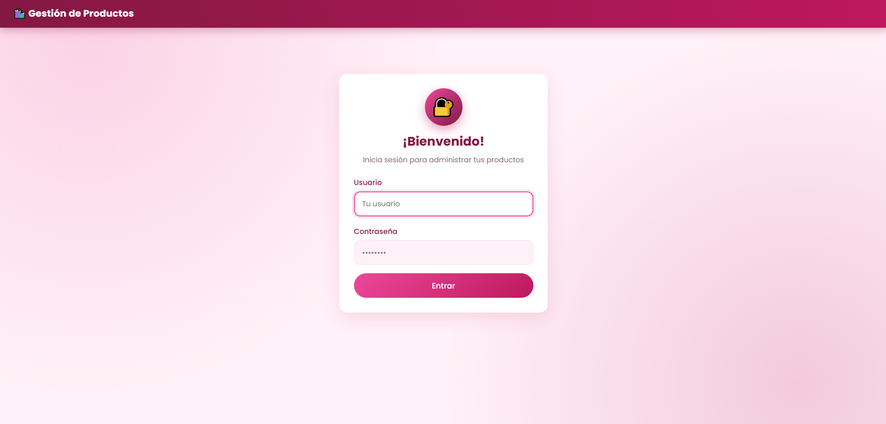
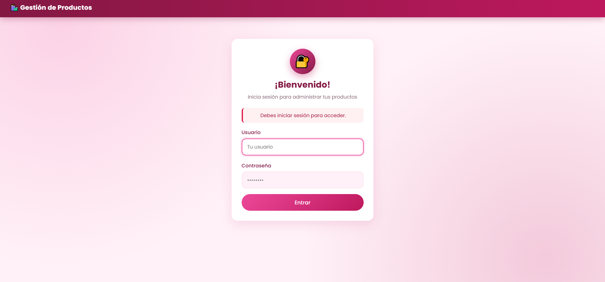
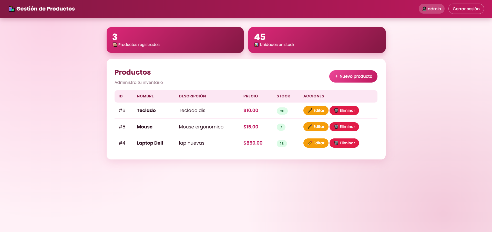

# CRUD de Productos con Login (PHP + MVC)

Aplicación web desarrollada con el patrón **MVC** en PHP puro que incluye un sistema de autenticación y un CRUD protegido de productos.

## Características

- Patrón MVC (Modelos, Vistas, Controladores y enrutador propio).
- Login con usuario y contraseña, y cierre de sesión.
- Contraseñas almacenadas mediante **bcrypt** usando `password_hash()`.
- CRUD completo: crear, leer, actualizar y eliminar productos.
- Rutas protegidas: sin sesión se redirige al login.
- Consultas preparadas con PDO para reducir el riesgo de inyección SQL.
- Escape de HTML para reducir el riesgo de XSS.

## Tecnologías

PHP 8
- MySQL/MariaDB
- Apache
- XAMPP
- HTML
- CSS3
- Diseño responsive

## Estructura

```text
app/       → controllers, models, views, core y config
database/  → schema.sql y seed.php
public/    → index.php y .htaccess
```

## Instalación

1. Instala XAMPP e inicia Apache y MySQL.
2. Clona el repositorio dentro de `htdocs`:

```bash
cd C:\xampp\htdocs
git clone https://github.com/YueAinhoa/mvc-crud-login.git
```

3. Importa `database/schema.sql` en phpMyAdmin.
4. Revisa `app/config/config.php` (credenciales de BD y `BASE_URL`).
5. Crea el usuario inicial:

```bash
C:\xampp\php\php.exe database\seed.php
```

6. Abre:

```text
http://localhost/mvc-crud-login/public/
```

## Credenciales de prueba

| Usuario | Contraseña |
|---------|------------|
| admin   | admin123   |


## Seguridad

- Contraseñas con hash bcrypt (más seguro que MD5).
- `Auth::requireLogin()` en el constructor del controlador protegido.
- Eliminación solo por POST.
- `app/` y `database/` bloqueadas con `.htaccess`.

## Capturas de pantalla

### Login



### Mensaje de Inicio de sesión



### CRUD de Productos



## Video demostrativo

[Ver video](PEGA_AQUI_EL_LINK)

## Autor

Ainhoa Yue · [GitHub](https://github.com/YueAinhoa)